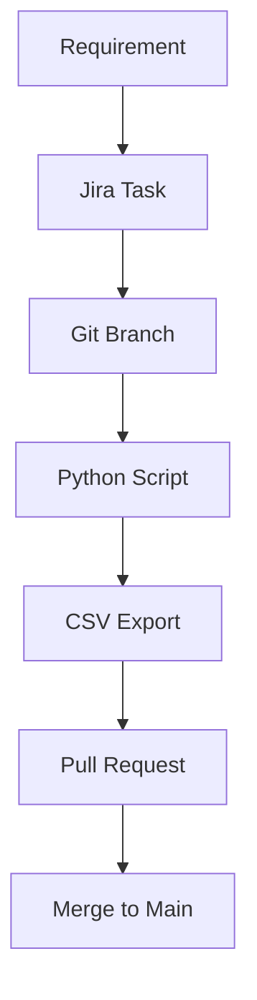

# System Design & Traceability – CNC Machine Project

> *“Documentation provides traceability, repeatability, and ensures the understanding is maintained throughout the project life cycle.”*  
> — **NASA Systems Engineering Handbook (SP-6105)**


# System Design & Traceability – CNC Machine Project
> *"You’re not just building a machine — you’re engineering the process of how machines are born."*  


# Traceability Graph



---

### Project Repository Structure 

```
📦 BB9-PLM/
├── 📘 README.md                   ← 🧭 Everything what you see here :)
│
├── 📁 SYS/                        ← Everything which describes the System
│   ├── 📘 instruction1.md
│   └── 📘 instruction2.md
│
├── 📁 PLC/                         ← PLC Dragons
│   ├── 🐲 BB9-Seedra-4024          ← Complete PLC Project
│   ├──  
│   └── 
│
├── 📁 ELE/               			← Electrical documentation from an external supplier
│   ├── ⚡ Electrical_documentation
│   └── 
│
├── 📁 CAD/                    		← CAD documentation, note that the icon is an ice-cube which is fun
│   ├── 🧊 BB9_assembly.3df
│	├── 📚 [BB-PLM-CAD](https://docs.google.com/spreadsheets/d/1WS5pffsgcz1e94PknavtNsX5TzpDEnNWbKK66kptzpY/edit?usp=sharing)
│   ├── 📗 req_cross_sections.csv
│	├──	📗 req_materials.csv
│	└── 📗 BOM.csv
│   │
│	📁 fusion_API_scripts/         ← Automation scripts for the Fusion 
│   ├── 🐍 export_sketch_area.py
│   └── 🐍 export_bom.py/   
│
│
├── 📁 .github/                    ← Automation scripts for the Github actions
│    └── 📁 Workflows
│    	 └── ⚽ automation1.yml		
│		 └──  
│
├── 📘 IO_mapping_table.csv			← GLUE, everything which integrates data from the SPEC folders togheter

```
