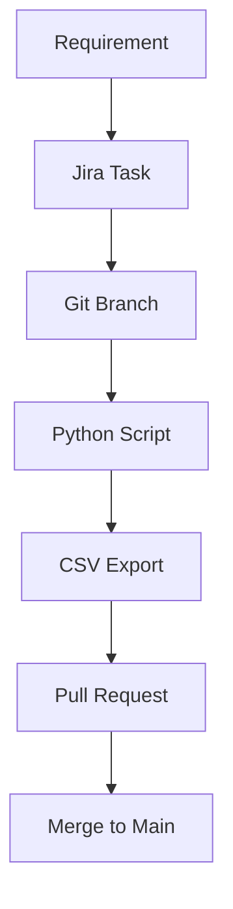

### TRACEABILITY and FORMALISATION
This repository serves as the formal and traceable source of truth for the machine’s CAD, PLC, and electrical design.

##  



---

## Project Repository Structure 
[S]YS [P]LC [E]LE [C]AD -> SPEC
```
📦 BB9-PLM/	
├── 📘 README.md                     ← 🧭 Everything what you see here :)
│
├── 📁 SYS/                          ← Everything which describes the System and it's FORMAL
│   ├── 📘 naming_convetions.md
│   └── 📘 instruction2.md
│
├── 📁 PLC/                          ← PLC Dragons
│   ├── 🐲 BB9-Seedra-4024           ← Complete PLC Project
│   ├──  
│   └── 
│
├── 📁 ELE/                           ← Electrical documentation from an external supplier
│   ├── ⚡ Electrical_documentation
│   └── 
│
├── 📁 CAD/                    	      ← CAD documentation
│   ├── 🧊 MACHINE_BB9_assembly	.stl  ← SNAPSHOTS 
│   ├── 🧊 EQ_BB9_assembly.stl
│   ├──	🧊 P_40x40_profile.stl
│   ├── 📗 req_cross_sections.csv
│   ├──	📗 req_materials.csv
│   └── 📗 BOM.csv
│   │
│   📁 fusion_API_scripts/           ← Automation scripts for the Fusion 
│   ├── 🐍 export_sketch_area.py
│   └── 🐍 export_bom.py 
│
│
├── 📁 .github/                      ← Automation scripts for the Github actions
│    └── 📁 Workflows
│         └── ⚽ automation1.yml
│         └── 
│
└── 📘 IO_mapping_table.csv	           ← GLUE, everything which integrates data from the SPEC folders togheter


